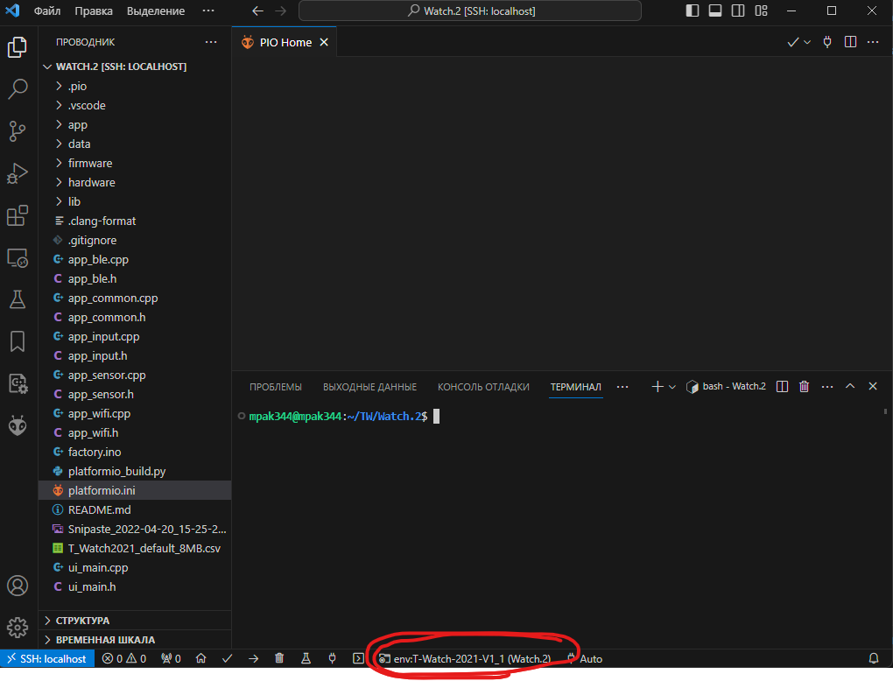

# Astute watch

## Watch 1 
Является архивным проектом, форк проекта https://github.com/sharandac/My-TTGO-Watch
Была законсервирована, т.к. хоть с одной стороны и имела "готовую оболочку" для разработки приложений. Не является операционной системой в полной мере. Из-за проблем с эвент лупом так и не получилось достугнуть хоть сколько-нибудь стабильной передачи данных через блютуз.

## Watch 2
Базовая прошивка для часов на базе LiliGO взята отсюда https://github.com/Xinyuan-LilyGO/T-Watch-2021/tree/main/software/factory

В текущем состоянии, вся логика приложения находится в файле
hardware/arenabridge.cpp

Прошивка, умеет принимать пачку изображений и возвращать отчёт о быстродействии.
### перед началом работы:
Для сборки, нужно установить расширение vscode https://platformio.org/platformio-ide

подробнее по установке можно посмотреть тут https://www.youtube.com/watch?v=wUGADCnerCs

### Порядок сборки:

* Открыть папку Watch2 в vscode
* Выбрать окружение для сборки проекта, оно одноимённо с моделью часов(вся информация о конфигурации сборки находится в файле platformio.ini)

* запустить компиляцию и установку прошивки
* Если компиляция прошла успешно, прошивка автоматически инсталлируется на часы
* Для просмотра логов нужно нажать кнопку Serial monitor

### Важное уточнение для разработки использовалась Ubuntu Ubuntu 22.04.2 LTS